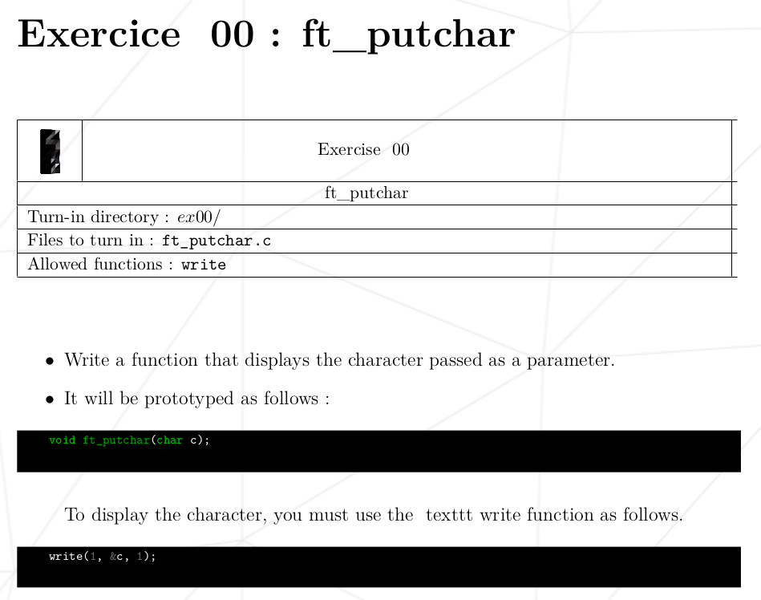

# C00->ex00: `ft_putchar`


### Allowed Functions:
- `Write()` from `<unistd.h>`

### Task:
1. Write a function that displays the character passed as a parameter.
2. It will be prototyped as follows :
`void ft_putchar(char c);`
To display the character, you must use the texttt write function as follows.
`write(1, &c, 1);`

### Resource:
1. [Learn about system calls in C](https://www.geeksforgeeks.org/input-output-system-calls-c-create-open-close-read-write/)
   
### Walkthrough:

I started by learning what `write()` does, which led me to explore system calls in C.
After understanding how **system calls and file descriptors** work, I was able to grasp what happens behind the scenes.

The `write()` function is available in the `<unistd.h>` header — a **UNIX Standard Header** that contains system-level functions like **read(), write(), close(), etc.**

Since the question does not require returning anything, we use **void** as the return type.
Also, the function name must exactly match the one specified by **42 school**:
`void ft_putchar(char c){}`

very important to understand the write funtion how its work:

**syntax**
`write (fd, buf, cnt);`

**Parameters**
- fd: file descriptor
- buf: buffer to write data from.
- cnt: length of the buffer.
  
**Return Value**
- Returns the number of bytes written on success.
- Return 0 on reaching the End of File.
- eturn -1 on error.
- Return -1 on signal interrupts.

| Descriptor | Meaning  | Purpose                       |
| ---------- | -------- | ----------------------------- |
| `0`        | `stdin`  | Standard Input (keyboard)     |
| `1`        | `stdout` | Standard Output (screen)      |
| `2`        | `stderr` | Standard Error (error output) |

`write(1, &c, 1);`

**Breakdown**
- 1 first parameter refer file descriptor we need output an terminal so we use 1,
- &c memory address so we use address symbal &, C just variable
- 1 last one is size we need to mention how many size we need to allocate the memory to store.

```c
#include <unistd.h>

void ft_putchar(char c) {
    write(1, &c, 1);  // Write 1 byte from the address of 'c' to standard output (stdout)
}

Main function to test ft_putchar
int main(void) {
    ft_putchar('Z');   // Prints the character 'Z'
    ft_putchar('\n');  // Prints a newline for clean output
    return 0;
}
